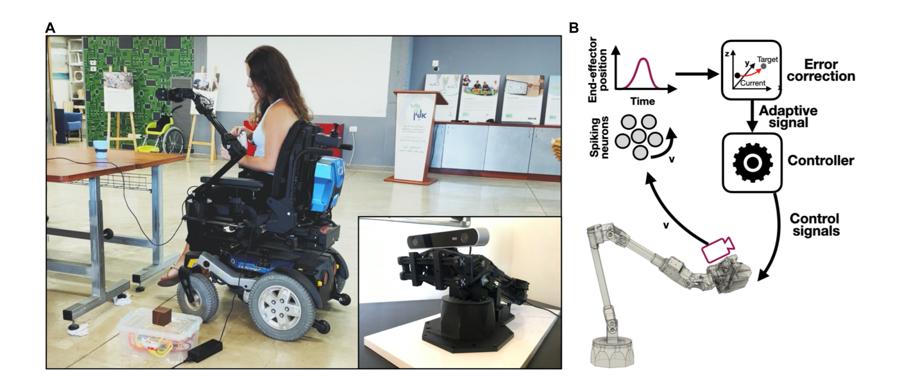

# 2022: Adaptive Control of a Wheelchair-Mounted Robotic Arm with Neuromorphically Integrated Velocity Readings and Online-Learning

## Paper Info

**Authors:** Ehrlich et al.  
**Publication:** Frontiers in Neuroscience, 2022  
**Links:** [PDF](https://static1.squarespace.com/static/555995e2e4b0c9f3319aaa47/t/634cd6fc7d268b0d73c1622e/1665980166402/2022+Ehrlich+et+al.pdf) | [GitHub](https://github.com/NBELab/Adaptive_arm_control)

---

## Overview

This paper extends the 2021 SNN approach to handle real-world challenges: unexpected payloads, sensor integration, and online adaptation. The application is a wheelchair-mounted robotic arm that needs to adapt when picking up heavy objects without manual recalibration.

### The Problem

Traditional controllers fail when:
- User picks up something heavy → changes inertia
- Mass distribution shifts unexpectedly
- Real-world dynamics don't match the model

For assistive robotics (wheelchairs), you can't just stop and retune parameters every time conditions change!

### Key Math

**Neuromorphic Sensor Integration:**

Integrating accelerometer data to get position using recurrent SNNs:

$$
x(t) = \int v(t) \, dt
$$

This is implemented as a neural integrator—LIF neurons with feedback connections that maintain state over time.

**PES Learning for Adaptation:**

Online weight updates based on error:

$$
\Delta w = \kappa \mathbf{e} \mathbf{a}
$$

where $\mathbf{e}$ is trajectory error, $\mathbf{a}$ is neural activity, $\kappa$ is learning rate (~$10^{-6}$ to $10^{-4}$)

**Stability condition:** $\gamma = a - \kappa \|\delta\|^2 > -1$ ensures learning stays bounded

### What They Did

**Hardware:** ViperX 300 arm + wheelchair mount + Intel Loihi  
**Simulation:** MuJoCo physics engine  
**Control:** Operational Space Control (OSC) + Adaptive SNN module

**Architecture:**

Task-space control with adaptive compensation:

$$
\tau = J^T(\mathbf{q}) \mathbf{F}_{\text{task}} + \tau_{\text{adaptive}}
$$

**SNN module:**
- 1000 LIF neurons per ensemble
- PES learning rate: $\kappa = 10^{-6}$
- Time constants: 12ms (input), 200ms (output smoothing)

### Experiments

**1. Baseline:** Normal trajectory following (no payload)

**2. Unexpected Payload:** Add 0.5-1.0 kg mid-trajectory
   - Without adaptation: 15-20% deviation
   - With adaptation: < 5% deviation, converges in 1-2 seconds

**3. ADL Tasks:** Activities of daily living (reach, grasp, transfer)
   - User study: 10 caregivers evaluated the system
   - Feedback: More natural and reliable than fixed controllers

### Results

**Performance:**
- Adaptation time: 1-2 seconds
- Maintains sub-mm accuracy after adaptation
- Trajectory deviation drops from >15% to <5%

**Energy Efficiency:**
- Intel Loihi: 100× less power than CPU/GPU
- Critical for battery-powered wheelchairs (full-day operation)

**Comparison:**

| Metric | Traditional OSC | Neuromorphic Adaptive |
|--------|----------------|----------------------|
| Payload compensation | Manual retuning | Automatic (1-2s) |
| Energy | 10-100W | < 1W |
| Adaptation | None | Real-time |
| Clinical validation | Limited | Validated |

### Why This Matters

**Key advancement over 2021:** The 2021 paper did deterministic control (solving IK for known models). This paper proves SNNs can handle **non-stationary environments** through online learning—essential for real-world robotics where models never perfectly match reality.

**Contributions:**
- Neuromorphic sensor integration (IMU → SNN)
- Real-time payload adaptation (no retraining needed)
- Clinical validation with caregivers
- Energy efficiency for assistive devices

### Connection to Other Work

**Builds on:** 2021 NEF/SNN infrastructure, PES learning, Loihi deployment

**Enables:** 2024 adaptive MPC—proves SNNs can learn to correct model errors in real-time, which is exactly what adaptive MPC needs

---
