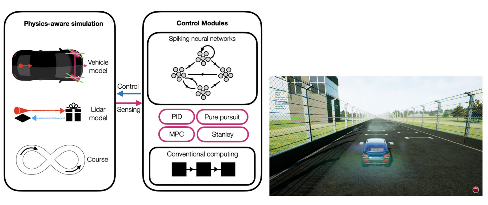
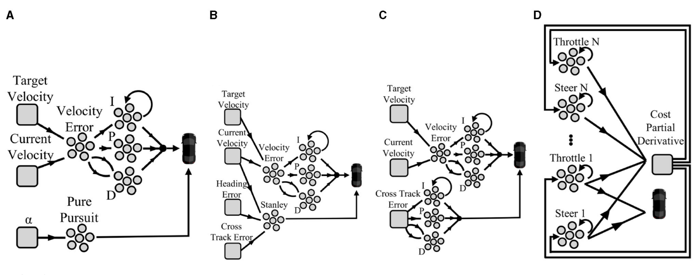

# 2023: Autonomous Driving Controllers with Neuromorphic Spiking Neural Networks

## Paper Info

**Authors:** Halaly & Ezra Tsur  
**Publication:** Frontiers in Neurorobotics, August 2023  
**Link:** [PDF](https://static1.squarespace.com/static/555995e2e4b0c9f3319aaa47/t/64d611c14f50ac4c8902fb29/1691750853375/2023+Halaly+et+al.pdf)

---

## Overview

This paper explores neuromorphic implementations of four path-tracking controllers for autonomous driving: **Pure-pursuit, Stanley, PID, and MPC**. The goal is to demonstrate that SNNs can perform competitively with conventional CPU-based controllers while offering significant energy efficiency advantages.

Application: Autonomous vehicle control in AirSim physics simulator on the FST Driverless race course.

### The Problem

Autonomous driving systems require significant computational and energy resources. Traditional CPU-based controllers are accurate but energy-intensive. Can neuromorphic brain-inspired control match their performance while being more energy-efficient?

Path-tracking controllers need to:
- Follow reference trajectories accurately
- Maintain vehicle stability and safety
- Operate in real-time with low latency
- Minimize energy consumption for deployment

### Key Math

**Neural Engineering Framework (NEF):**

The NEF provides three principles for neuromorphic design:

1. **Representation:** Encode values as spikes
   $$\delta_i(x) = G_i\left[\alpha_i \langle \tilde{\phi}_i, x(t) \rangle + J^{\text{bias}}_i\right]$$

2. **Transformation:** Decode and compute functions
   $$\hat{f}(x(t)) = \sum_i (h_i(t) * \delta_i(t)) d^f_i$$

3. **Dynamics:** Implement feedback loops
   $$\dot{x} = A'x(t) + B'u(t)$$

**Kinematic Bicycle Model (KBM):**

Vehicle state: $[x, y, \theta, \delta]$ (position, heading, steering angle)  
Vehicle input: $[v, \phi]$ (velocity, steering rate)

$$
\begin{aligned}
x(t+1) &= x(t) + v \cos(\theta(t)) \Delta t \\
y(t+1) &= y(t) + v \sin(\theta(t)) \Delta t \\
\theta(t+1) &= \theta(t) + \frac{v \tan \delta(t)}{L} \Delta t \\
\delta(t+1) &= \delta(t) + \phi \Delta t
\end{aligned}
$$

### What They Did

**Hardware:** Microsoft AirSim physics simulator  
**Environment:** FST Driverless race course (15m wide track)  
**Vehicle:** SUV with LiDAR sensor (180° FOV, 40m range, 40 Hz)  
**Control rate:** 200 Hz (5ms timestep)

**Four Controllers Implemented:**

**A. Pure-Pursuit:** Geometrically chases a point ahead on the reference trajectory

$$
\delta(t) = \arctan\left(\frac{2L \sin \alpha}{l_d}\right)
$$

**B. Stanley:** Minimizes both cross-track error (CTE) and heading error

$$
\delta(t) = \psi(t) + \tan^{-1}\left(\frac{k \cdot e(t)}{k_s + v(t)}\right)
$$

**C. PID:** Continuous error-correcting control

$$
u(t) = K_p e(t) + K_i \int_0^t e(t)dt + K_d \frac{de}{dt}
$$

**D. MPC (Hybrid):** Predictive optimization—CPU calculates cost function, SNN optimizes policy using $2N$ neural integrators with RMSprop gradient descent.

**Test Conditions:**
- Target speeds: 2, 5, 10, 15, 20 m/s
- Neuron counts: 10, 25, 50, 100, 250, 500, 1000, 2500 (up to 10000 for Stanley)
- Synaptic time constants ($\tau$): 5, 10, 50, 100, 300, 500, 700, 900, 1100 ms
- 10 runs per configuration

### Results

**Performance Summary:**

| Controller | Min Neurons | Optimal Neurons | Speed Range | CTE (low speed) | CTE (high speed) |
|------------|-------------|-----------------|-------------|-----------------|------------------|
| Pure-pursuit | 10 | 100 | 2-15 m/s | 0.12-0.23m | 2.02m (15 m/s) |
| Stanley | 250 | 1000-2500 | 2-15 m/s | 0.90m | Degraded |
| PID | 50 | 100-500 | 2-20 m/s | Competitive | Outperforms CPU |
| MPC | 10 | 100 | 2-15 m/s | 1.04m | Fails at 20 m/s |

**Key Findings:**
- **Pure-Pursuit:** 100 neurons sufficient, requires $\tau \leq 10$ms, degrades at >15 m/s
- **Stanley:** Needs >1000 neurons for smooth driving, zig-zag patterns with fewer
- **PID:** Sweet spot at 100-500 neurons, actually outperforms CPU at 20 m/s
- **MPC:** Hybrid design achieves excellent performance with just 10 neurons!

**Convergence:** All neuromorphic controllers matched or approached CPU performance at speeds up to 15 m/s.

**Time Constants Critical:** Fast synaptic responses ($\tau < 100$ms) essential for real-time control.

### Why This Matters

**Key contributions:**

1. **Neuromorphic controllers are viable:** All four controllers performed competitively with CPU implementations at speeds up to 15 m/s.

2. **Efficiency sweet spot:** Most models converge to optimal performance with just 100-1000 neurons (MPC needs only 10!).

3. **Time constants are critical:** Fast synaptic responses ($\tau < 100$ms) essential for real-time control.

4. **Hybrid designs work:** MPC's hybrid neuromorphic-CPU approach achieves excellent performance with minimal neuronal resources.

5. **Energy implications:** Neuromorphic hardware (TrueNorth, Loihi, SpiNNaker) typically offers 10-100× energy savings—critical for battery-powered autonomous vehicles.

**First systematic comparison** of neuromorphic vs. CPU path-tracking controllers with practical guidelines for tuning neuromorphic control systems.

**Limitations:** High-speed degradation (>15 m/s) and rate-coding representation constraints suggest need for alternative spike coding schemes.

### Connection to Other Work

**Timeline:** 2021 (NEF/SNN robotics) → 2022 (adaptive control) → **2023 (autonomous driving)** → 2024 (adaptive MPC)

**Builds on:**
- 2021: NEF infrastructure for SNN control
- 2022: PES learning, online adaptation

**Enables:**
- 2024: Adaptive MPC with continuous model correction—addresses the high-speed limitations found in this paper by adding real-time learning

**Key bridge:** This paper demonstrates that SNNs can handle **reactive control** (path tracking). The 2024 paper extends this to **predictive control** (MPC with adaptation), combining the best of both worlds.

---
