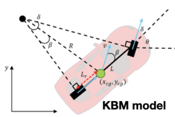

## Kinematic Bicycle Model (KBM)

### Introduction

The **Kinematic Bicycle Model (KBM)** is a simplified vehicle dynamics framework that represents a four-wheeled vehicle as a two-wheeled bicycle system. This model approximates vehicle motion by:

- **Simplification:** Front wheels merge into one steerable wheel; rear wheels merge into one non-steerable wheel.
- **Assumptions:** Rigid body, pure rolling (no slip), planar motion on flat terrain.
- **Reference Point:** Rear axle, front axle, or center of mass (CoM).
- **Applications:** Path planning, motion control, neuromorphic vehicle systems, autonomous driving.

The KBM is foundational across automotive control, robotics, and aerospace, providing the mathematical basis for trajectory prediction and controller design. Two implementations—static (2023) and adaptive (2024)—demonstrate the model's scalability from classical to neuromorphic systems.

### Kinematic Bicycle Model Visualization

### KBM Mathematical Notation Table

\footnotesize

| Notation | Description |
| :-- | :-- |
| $x, y$ | Vehicle position coordinates (global reference frame) |
| $\theta$ | Heading angle (vehicle orientation from x-axis) |
| $\cos(\theta), \sin(\theta)$ | Heading angle components (split representation) |
| $\delta$ | Steering angle (front wheel deflection) |
| $\dot{\delta}$ | Steering rate (change in steering angle per time) |
| $v$ | Vehicle velocity (longitudinal speed) |
| $v_x, v_y$ | Velocity components (longitudinal and lateral) |
| $a_x, a_y$ | Acceleration components (longitudinal and lateral) |
| $v_r$ | Angular velocity (yaw rate: $\dot{\theta}$) |
| $L$ | Wheelbase (distance between front and rear axles) |
| $L_r$ | Distance from rear axle to center of mass |
| $\beta$ | Slip angle (angle between velocity vector and heading) |
| $R$ | Turning radius (instantaneous radius of circular path) |
| $\tau$ | Throttle-brake control input |
| $t, \Delta t$ | Time and discrete time step |
| $\mathbf{s}$ | State vector |
| $\mathbf{u}$ | Control input vector |

\normalsize

### Geometric Relationships

#### Turning Radius

The instantaneous radius of the circular path followed by the vehicle is determined by wheelbase and steering angle:

$$
R = \frac{L}{\tan(\delta)}
$$

**Interpretation:** Larger steering angle $\delta$ produces smaller turning radius $R$ (tighter turn). Longer wheelbase $L$ produces larger $R$ (wider turn for same steering).

#### Yaw Rate (Angular Velocity)

The rate of vehicle heading change is:

$$
\omega = \dot{\theta} = \frac{v \tan(\delta)}{L} = \frac{v}{R}
$$

**Interpretation:** Higher vehicle speed $v$ or sharper steering $\delta$ produces higher yaw rate. Longer wheelbase $L$ reduces yaw rate for fixed steering and speed.

#### Slip Angle (Center of Mass Reference)

When using the center of mass as reference point, the slip angle accounts for the angular deviation between velocity vector direction and vehicle heading:

$$
\beta = \arctan\left(\frac{L_r \tan(\delta)}{L}\right)
$$

where $L_r$ is the distance from rear axle to CoM.

**Interpretation:** Slip angle $\beta$ captures the geometric offset when reference point is not at rear axle. Typical range: $|\beta| < 5°$ for normal driving.

### Kinematic Model: Rear Axle Reference (2023)

#### Discrete-Time Formulation

Using the rear axle as reference point:

$$
\begin{align}
x(t+1) &= x(t) + v \cos(\theta(t)) \Delta t \\
y(t+1) &= y(t) + v \sin(\theta(t)) \Delta t \\
\theta(t+1) &= \theta(t) + \frac{v \tan(\delta(t))}{L} \Delta t \\
\delta(t+1) &= \delta(t) + \dot{\delta} \Delta t
\end{align}
$$

#### Continuous-Time Formulation

$$
\begin{align}
\dot{x} &= v \cos(\theta) \\
\dot{y} &= v \sin(\theta) \\
\dot{\theta} &= \frac{v \tan(\delta)}{L} \\
\dot{\delta} &= \dot{\delta}
\end{align}
$$

#### State and Control Vectors

**State vector** (4-dimensional):
$$
\mathbf{s} = \begin{bmatrix} x \\ y \\ \theta \\ \delta \end{bmatrix} \in \mathbb{R}^4
$$

**Control input vector**:
$$
\mathbf{u} = \begin{bmatrix} v \\ \dot{\delta} \end{bmatrix}
$$

### Kinematic Model: Front Axle Reference (2023)

#### Discrete-Time Formulation

Using the front axle as reference point:

$$
\begin{align}
x(t+1) &= x(t) + v \cos(\theta(t) + \delta(t)) \Delta t \\
y(t+1) &= y(t) + v \sin(\theta(t) + \delta(t)) \Delta t \\
\theta(t+1) &= \theta(t) + \frac{v \sin(\delta(t))}{L} \Delta t \\
\delta(t+1) &= \delta(t) + \dot{\delta} \Delta t
\end{align}
$$

#### Continuous-Time Formulation

$$
\begin{align}
\dot{x} &= v \cos(\theta + \delta) \\
\dot{y} &= v \sin(\theta + \delta) \\
\dot{\theta} &= \frac{v \sin(\delta)}{L} \\
\dot{\delta} &= \dot{\delta}
\end{align}
$$

**Key Difference:** Position update includes steering angle $\delta$ added to heading $\theta$; heading update uses $\sin(\delta)$ instead of $\tan(\delta)$.

### Kinematic Model: Center of Mass Reference (2024)

#### Extended State Formulation

Using the **center of mass (CoM)** as reference with extended state space:

$$
\begin{align}
\dot{x} &= v_x \cos(\theta) \\
\dot{y} &= v_y \sin(\theta) \\
\dot{\theta} &= \frac{v \tan(\delta) \cos(\beta)}{L} \\
\dot{v}_x &= a_x \cos(\theta) \\
\dot{v}_y &= a_y \sin(\theta)
\end{align}
$$

where the slip angle is:

$$
\beta = \arctan\left(\frac{L_r \tan(\delta)}{L}\right)
$$

#### Extended State and Control Vectors

**Extended state vector** (9-dimensional):
$$
\mathbf{s} = \begin{bmatrix} x \\ y \\ \cos(\theta) \\ \sin(\theta) \\ v_x \\ v_y \\ a_x \\ a_y \\ v_r \end{bmatrix} \in \mathbb{R}^9
$$

**Control input vector**:
$$
\mathbf{u} = \begin{bmatrix} \tau \\ \delta \end{bmatrix}
$$

where $\tau$ is throttle-brake input, $\delta$ is steering angle.

#### Why Extended States?

- **Heading Components** ($\cos(\theta), \sin(\theta)$): Neural networks handle periodic variables better without wrapping issues.
- **Velocity Components** ($v_x, v_y$): Separates longitudinal and lateral motion; captures actual direction of motion.
- **Acceleration** ($a_x, a_y$): Provides dynamic context for learning algorithms.
- **Angular Velocity** ($v_r$): Explicit yaw rate for better state reconstruction.

### Reference Point Comparison

| Feature | Rear Axle | Front Axle | Center of Mass |
| :-- | :-- | :-- | :-- |
| **Equation Complexity** | Simple | Moderate | Complex (with $\beta$) |
| **Reference Location** | Rear wheel contact | Front wheel contact | Mid-wheelbase (typically) |
| **Slip Angle** | Not needed | Not needed | Required: $\beta$ |
| **State Dimensions** | 4 | 4 | 9 (extended) |
| **Heading Update** | $\frac{v \tan(\delta)}{L}$ | $\frac{v \sin(\delta)}{L}$ | $\frac{v \tan(\delta) \cos(\beta)}{L}$ |
| **Position Update** | $v \cos(\theta)$ | $v \cos(\theta + \delta)$ | $v_x \cos(\theta)$ |
| **Primary Application** | Path planning | Front-wheel systems | Adaptive control, learning |
| **Computational Load** | Low | Low | Medium |

### Implementation Comparison: 2023 vs. 2024

#### 2023 Paper: Static Kinematic Bicycle Model

**Reference Point:** Rear or front axle  
**State Dimension:** 4 (position x, y; heading $\theta$; steering angle $\delta$)  
**Control Inputs:** ($v$, $\dot{\delta}$) — velocity and steering rate  
**Purpose:** Neuromorphic implementation of classical controllers (Pure-Pursuit, Stanley, PID, MPC)  

**Core Equations:**
$$
\begin{align}
\dot{x} &= v \cos(\theta) \\
\dot{y} &= v \sin(\theta) \\
\dot{\theta} &= \frac{v \tan(\delta)}{L}
\end{align}
$$

**Characteristics:**
- Fixed, non-adaptive model
- Assumes perfect knowledge of vehicle dynamics
- External velocity control (velocity setpoint applied)
- No online learning or error correction

#### 2024 Paper: Extended Adaptive Kinematic Bicycle Model

**Reference Point:** Center of mass (CoM)  
**State Dimension:** 9 (position, heading components, velocity components, acceleration components, angular velocity)  
**Control Inputs:** ($\tau$, $\delta$) — throttle-brake and steering angle  
**Purpose:** Continuous adaptive nonlinear MPC with real-time learning via spiking neural networks  

**Core Equations:**
$$
\begin{align}
\dot{x} &= v_x \cos(\theta) \\
\dot{y} &= v_y \sin(\theta) \\
\dot{\theta} &= \frac{v \tan(\delta) \cos(\beta)}{L}, \quad \beta = \arctan\left(\frac{L_r \tan(\delta)}{L}\right) \\
\dot{v}_x &= a_x \cos(\theta) \\
\dot{v}_y &= a_y \sin(\theta)
\end{align}
$$

**Characteristics:**
- Adaptive model with online learning (PES rule)
- Accounts for model-reality mismatch (intentional $L_r = L/2$ simplification)
- Integrated throttle-brake control (no external velocity loop)
- Real-time error correction and compensation
- Slip angle correction for CoM reference

#### State Vector Evolution

| Aspect | 2023 | 2024 |
| :-- | :-- | :-- |
| Position | $x, y$ | $x, y$ |
| Heading | $\theta$ (single angle) | $\cos(\theta), \sin(\theta)$ (components) |
| Steering | $\delta$ | $\delta$ (input, not state) |
| Velocity | External setpoint $v$ | $v_x, v_y$ (state components) |
| Acceleration | None | $a_x, a_y$ (state components) |
| Angular Velocity | Derived as $\dot{\theta}$ | $v_r$ (explicit state) |
| Slip Angle | Not used | $\beta$ (correction term) |
| Learning | None | PES-based adaptation |

### Geometric Calculations: Practical Example

#### Given Parameters
- Wheelbase: $L = 3.0$ m (typical sedan)
- Steering angle: $\delta = 20° = 0.349$ rad
- Velocity: $v = 10$ m/s

#### Turning Radius

$$
R = \frac{L}{\tan(\delta)} = \frac{3.0}{\tan(0.349)} = \frac{3.0}{0.364} = 8.24 \text{ m}
$$

#### Yaw Rate

$$
\omega = \frac{v}{R} = \frac{10}{8.24} = 1.21 \text{ rad/s} = 69.3°/\text{s}
$$

#### Time to Complete Circle

$$
T = \frac{2\pi}{\omega} = \frac{2\pi}{1.21} = 5.2 \text{ seconds}
$$

**Interpretation:** At 10 m/s with 20° steering on a 3-meter wheelbase vehicle, the vehicle follows a circular path with 8.24 m radius, rotating 69.3° per second, completing one circle every 5.2 seconds.

### Model Assumptions and Limitations

#### Core Assumptions
- **Pure Rolling:** Wheels roll without lateral slip or skidding.
- **Rigid Body:** Vehicle frame is perfectly rigid; no bending or deformation.
- **Planar Motion:** Vertical motion is negligible; movement is 2-dimensional.
- **Perfect Actuation:** Steering angle $\delta$ is realized exactly; no delay or backlash.
- **Known Parameters:** Wheelbase $L$ and center of mass location $L_r$ are precisely known.

#### Limitations
- **Valid Speed Range:** Most accurate below 15 m/s; breaks down at high speeds where tire slip dominates.
- **No Weight Transfer:** Ignores load shifts during acceleration or braking; assumes mass distribution stays constant.
- **Small Angle Approximation:** $\tan(\delta)$ becomes inaccurate for steering angles beyond $\pm 45°$.
- **Flat Terrain Only:** No accounting for slopes, banking, or uneven surfaces.
- **No Dynamic Effects:** Ignores suspension compliance, tire compliance, and vehicle roll/pitch.

### Discretization for Implementation

For computational systems, continuous equations are discretized using **Forward Euler** integration:

$$
\mathbf{s}(t + \Delta t) = \mathbf{s}(t) + \dot{\mathbf{s}}(t) \cdot \Delta t
$$

**Typical Time Step:** $\Delta t = 0.01$ to $0.1$ seconds (10–100 Hz control rate)

**Stability Requirement:** Forward Euler requires small $\Delta t$ relative to system dynamics. For vehicle control, $\Delta t \leq 0.05$ s is recommended.

**Alternative Methods:** Higher-order methods (RK4, etc.) provide better stability at the cost of computational overhead.

### Summary

The **Kinematic Bicycle Model** provides a mathematically rigorous yet computationally efficient framework for vehicle motion prediction and control. Three reference point choices—rear axle, front axle, and center of mass—offer different tradeoffs between simplicity and physical realism.

The evolution from 2023 (4-state static model) to 2024 (9-state adaptive model) demonstrates how classical kinematic frameworks can be extended with additional state information and online learning mechanisms to enable robust autonomous systems capable of adapting to modeling errors and environmental disturbances in real-time.

**Key Formulas:**
- Turning radius: $R = L / \tan(\delta)$
- Yaw rate: $\omega = v \tan(\delta) / L$
- Slip angle: $\beta = \arctan((L_r \tan(\delta))/L)$
- Position: $\dot{x} = v \cos(\theta)$, $\dot{y} = v \sin(\theta)$
- Heading: $\dot{\theta} = v \tan(\delta) / L$ (rear axle); $\dot{\theta} = v \tan(\delta) \cos(\beta) / L$ (CoM)

